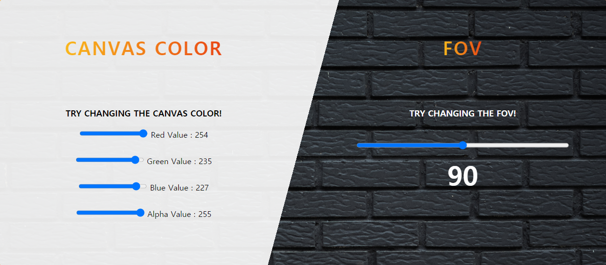

# WebGL Tutorial
### How to do texture mapping?

## Author
Chaejin Lim

## File list
- index.html
- gl-matrix.js
- script.js
- readme.md

## GOAL
- WebGL 이미지 텍스쳐 매핑에 대해 이해한다.
- HTML Canvas를 이용하여 텍스쳐 매핑을 하는 방법에 대해 이해한다.
- 텍스쳐 매핑의 여러 파라미터 쓰임에 대해 실습한다.
- 하나의 텍스쳐 이미지가 여러번 반복되도록 매핑해본다.

## Caveat
- CORS 이슈에 의해 이미지 텍스쳐 매핑이 제대로 동작하지 않을 수 있습니다. 이 경우 같은 폴더 내에 mongoose-free-6.5.exe를 넣고 이 실행파일을 실행하시면 로컬 웹 서버가 실행돼 CORS 이슈를 해결할 수 있습니다.
- Cube testing에서 cube의 초기 상태는 이미지 텍스쳐 매핑이 되어있는 상태입니다. 코드 변경을 통해 초기상태의 이미지 변경을 희망하실 경우 image object의 src 속성만 변경시켜주시면 되지만 변경되는 이미지는 반드시 가로 세로의 길이가 power of two를 만족해야 합니다. Power of two가 만족되지 않을 경우 이미지 텍스쳐 매핑이 되지 않습니다.

## Implementation
### 1. Intro
- Intro에는 texture mapping에 대한 개괄적인 설명과 튜토리얼을 시작하기 전 준비해야할 사항들에 대해 소개하는 섹션을 만들었습니다.

### 2. Image texture mapping
- Image texture mapping을 궁금해하는 사람들이 알기 쉽도록 image texture mapping을 설명하는 것이 튜토리얼의 주된 목적이기 때문에 이에 대해 설명하는 섹션을 만들었습니다.
- Image texture mapping에 대한 이론적인 설명보다는 image texture mapping을 어떻게 프로그램적으로 구현하는지 궁금해할 사람들이 더 많다고 판단하여 코드를 첨부하고 그 코드를 설명하는 식으로 튜토리얼을 구성했습니다.
- Image texture mapping에 대한 설명은 GPU에 텍스쳐 이미지를 바인딩하고 보내는 과정, 매핑 관련 파라미터를 설정하는 과정, Vertex shader, Fragment shader순으로 구성하였습니다.

### 3. HTML canvas mapping
- HTML canvas를 이용해서 texture mapping을 하는 방법에 대해 개괄적으로 설명하는 섹션을 만들었습니다.
- 이론적인 설명과 코드를 첨부하여 이에 대해 더 쉽게 이해할 수 있도록 구성하였습니다.

### 4. Cube testing
- 위에서 학습한 이론적인 내용들을 바탕으로 사용자가 직접 여러 버튼을 통해 큐브에 텍스쳐 매핑을 실습해볼 수 있는 섹션을 만들었습니다.

## Cube testing
### 1. Canvas color / FOV

슬라이드 버튼을 좌우로 이동시키면서 캔버스의 배경색을 바꾸거나 FOV를 변경할 수 있습니다.  
**[Change canvas color]** 캔버스의 배경색은 빨간색, 초록색, 파란색 그리고 투명도를 나타내는 알파값을 통해 컨트롤되며 각각은 0에서 255 사이의 값을 가집니다.  
**[FOV]** FOV는 슬라이드 버튼 하나로 컨트롤 되며 FOV는 10에서 170 사이의 값을 가집니다.

### 2. Upload image / Parameter

직접 고른 사진으로 큐브의 텍스쳐 이미지를 설정할 수 있고 텍스쳐 설정을 다루는 여러 파라미터들을 조작할 수 있습니다.  
**[Upload image]** Upload image의 경우 내부적으로 첨부된 사진의 크기를 power of two로 변경시켜주는 코드를 삽입했기 때문에 사진의 크기와 상관없이 원하는 사진을 선택하면 그 사진으로 큐브에 텍스쳐 매핑이 일어납니다. 사진의 크기를 변경시켜주기 위해서 HTML canvas를 사용했습니다. 파일을 이용해 이미지가 JavaScript 내로 들어오면 document를 사용해 canvas element를 만들고 canvas 객체의 내부 API를 이용해 사진을 2D context canvas로 만들면서 사진의 크기를 power of two로 변환시켜주었습니다. 이미지가 2D context를 가지는 HTML canvas로 변환되었기 때문에 텍스쳐 매핑시키기 위해서 캔버스를 다시 이미지로 변환시키는 작업이 필요했습니다. Canvas 객체는 내부적으로 `toDataURL()`이라는 메소드가 정의되어 있고 이 메소드는 HTML image 객체의 src로 사용될 수 있는 String형태 문자열을 반환하기 때문에 이를 이용해 이미지를 만들고 이를 텍스쳐 매핑시켜주었습니다. 다음과 같은 방법을 사용하므로서 또한 로컬 웹 서버 구동 없이도 CORS 이슈 없이 이미지 텍스쳐 매핑을 구현할 수 있었습니다.  
**[Parameter]** 텍스쳐 매핑에는 텍스쳐 매핑의 상태를 조정할 수 있는 여러 파라미터들이 있습니다. 실습을 통해 `TEXTURE_MIN_FILTER`, `TEXTURE_MAG_FILTER`, `TEXTURE_WRAP_S`, `TEXTURE_WRAP_T` 파라미터에 대해서 여러 설정값들을 조정할 수 있습니다.

### 3. Texture count / HTML canvas

Texture count 값을 바꿈으로서 텍스쳐 이미지가 오브젝트의 매핑되는 면보다 작은 경우에 대해 시뮬레이션해볼 수 있고 지정된 2D context의 HTML canvas를 이용해 HTML canvas 텍스쳐 매핑을 실습해볼 수 있습니다.  
**[Texture count]** Texture count 값을 바꾸게 되면 지정된 개수만큼 큐브의 한 면에 texture 이미지가 반복되서 나타납니다. 물론 앞에서 설명한 텍스쳐 관련 파라미터 값을 바꾸게 되면 이에 대한 모습이 달라지게 됩니다.  
**[HTML canvas]** 지정된 집 모양의 이미지는 사실 일반적인 이미지가 아니고 HTML canvas에서 2D context를 이용해 직접 그린 것입니다. update 버튼을 누르게 되면 이 2D context의 HTML canvas가 큐브에 텍스쳐로 지정된 모습을 보실 수 있습니다.

## License
[MIT License](./LICENSE)

## Reference
- Project idea inspired from [2020 better project](https://git.ajou.ac.kr/hwan/webgl-tutorial/-/tree/master/student2020/better_project)
- WebGL code based from [hwan-ajou/webgl-1.0](https://github.com/hwan-ajou/webgl-1.0)
- Edward Angel&Dave Shreiner, 『Interactive Computer Graphics-A top-down approach with WebGL 7TH EDITION』,PEARSON

### Code Reference
- https://git.ajou.ac.kr/hwan/webgl-tutorial/-/tree/master/student2020/better_project/201420976
- https://www.w3schools.com/csS/css3_buttons.asp
- https://developer.mozilla.org/en-US/docs/Web/API/CanvasRenderingContext2D
- https://developer.mozilla.org/en-US/docs/Web/API/WebGL_API/Tutorial/Using_textures_in_WebGL

